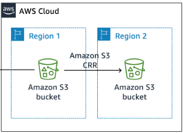

## Challenge Lab Creating-a-Static-Website-for-a-Cafe:AWS S3 Static Website Hosting

### Table of Contents
1. [Overview](#overview)
2. [Objectives](#objectives)
3. [Process](#️process)
   - [1. Create and Configure the S3 Bucket](#1-create-and-configure-the-s3-bucket)
   - [2. Upload Website Content](#2-upload-website-content)
   - [3. Set Public Access Permissions](#3-set-public-access-permissions)
   - [4. Enable Versioning](#4-enable-versioning)
   - [5. Implement Lifecycle Rules](#5-implement-lifecycle-rules)
   - [6. Configure Cross-Region Replication (CRR)](#6-configure-cross-region-replication-crr)
4. [Architecture Diagram](#architecture-diagram)
5. [Summary](#summary)

---

### Overview
This project demonstrates how to host, secure, version, and replicate a static website using **Amazon S3**.  
The goal was to build a simple café website and apply key AWS features that ensure **data protection**, **cost optimization**, and **disaster recovery**.

---

### Objectives
- **Host a static website** using **Amazon S3**.  
- **Implement data protection** measures such as versioning and access controls in Amazon S3.  
- **Apply a data lifecycle strategy** to optimize storage and manage object versions automatically.  
- **Set up a disaster recovery (DR) strategy** by enabling **Cross-Region Replication (CRR)**.

---

### Process 

#### 1. Create and Configure the S3 Bucket
- Created a bucket in **US East (N. Virginia)** (`us-east-1`).
- Cleared **Block all public access** and **enabled ACLs**.
- Enabled **Static Website Hosting** with `index.html` as the index document.

#### 2. Upload Website Content
Uploaded:
- `index.html`
- `images/` folder  
- `css/` folder  

Tested access via the **S3 static website endpoint**.

#### 3. Set Public Access Permissions
Configured the following **bucket policy** for public read access:

```json
{
  "Version": "2012-10-17",
  "Statement": [
    {
      "Sid": "PublicReadGetObject",
      "Effect": "Allow",
      "Principal": "*",
      "Action": "s3:GetObject",
      "Resource": "arn:aws:s3:::ellekay/*"
    }
  ]
}
```
#### 4. Enable Versioning
Enabled **Versioning** to track and preserve previous versions of all files.

Tested by modifying `index.html` and re-uploading  both versions remained accessible.

#### 5. Implement Lifecycle Rules
Created two **lifecycle rules** to manage storage efficiently:

- Move **noncurrent versions** to **S3 Standard-IA** after 30 days.  
- Delete **noncurrent versions** after 365 days.

#### 6. Configure Cross-Region Replication (CRR)
- Created a **destination bucket** in **US West (Oregon)** (`us-west-2`).  
- Enabled **versioning** on both source and destination buckets.  
- Set up replication using the **CafeRole** IAM Role with the following permissions:

```json
{
  "Version": "2012-10-17",
  "Statement": [
    {
      "Effect": "Allow",
      "Action": [
        "s3:ListBucket",
        "s3:Get*",
        "s3:ReplicateObject",
        "s3:ReplicateDelete",
        "s3:ReplicateTags"
      ],
      "Resource": "*"
    }
  ]
}
```
---

### Architecture Diagram

 


#### Architecture Best Practices

- Implemented **multi-region replication** for disaster recovery.  
- Applied **least privilege IAM policies** for secure access control.  
- Automated **data lifecycle management** for cost efficiency.  
- Maintained **version control** to recover from accidental deletions or overwrites.  

---

### Summary

- Small configuration details such as **permissions or ACL settings** can make or break a deployment.  
- **Lifecycle rules** play a vital role in automating cost management and data retention.  
- **Cross-Region Replication (CRR)** ensures high availability and durability across geographically distant AWS regions.  
- Hands-on configuration deepened my understanding of how **AWS S3** supports secure, scalable, and fault-tolerant architectures.  


